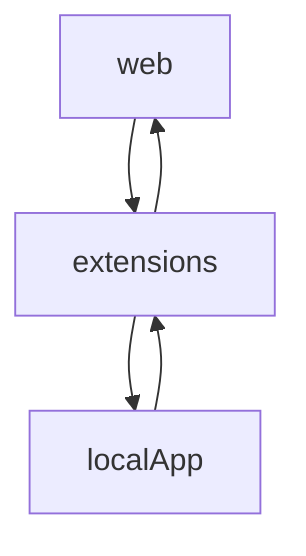

# chrome扩展与应用通过NativeMessage方式与原生应用通信
chrome与原生应用进行通信需要使用[NativeMassage](https://crxdoc-zh.appspot.com/apps/messaging#native-messaging-host),这样需要host和app/extensions两端。

整体通信流程：



## host
host端提供本地服务，需要的文件(文件名随意，此处以host-demo为例):
* host-demo.json
* host-demo.exe

### host-demo.json
用于定义原生应用配置的清单文件，json格式。
以下内容引用自[chrome文档](https://crxdoc-zh.appspot.com/apps/messaging#native-messaging-host)
一个典型的配置清单文件：
```json
{
  "name": "com.my_company.host-demo",
  "description": "我的应用程序",
  "path": "C:\\Program Files\\My Application\\chrome_native_messaging_host.exe",
  "type": "stdio",
  "allowed_origins": [
    "chrome-extension://knldjmfmopnpolahpmmgbagdohdnhkik/"
  ]
}
```
|项目|描述|
|---|---|
|name|原生消息通信宿主的名称，客户端(extension)需要将该字符串传递给 runtime.connectNative 或 runtime.sendNativeMessage。通过名字匹配。|
|description|应用程序的简短描述。|
|path|原生消息通信宿主的二进制文件路径。在 Linux 和 OSX 上必须使用绝对路径，在 Windows 上可以使用相对于清单文件所在目录的路径。|
|type|与原生消息通信宿主交流时所使用的接口类型。目前该参数只有一种可能的值：stdio，它表示 Chrome 浏览器应该使用 stdin（标准输入）和 stdout（标准输出）与宿主通信。|
|allowed_origins|允许访问原生消息通信宿主的扩展程序列表(此处/间的字符串是扩展安装chrome后的ID，可以在chrome://extension中查询到，必须匹配一致)|

清单文件的类型取决与平台：

Windows：
清单文件可以在文件系统中的任意位置，应用程序的安装程序必须创建如下注册表键 HKEY_LOCAL_MACHINE\SOFTWARE\Google\Chrome\NativeMessagingHosts\com.my_company.my_application 或 HKEY_CURRENT_USER\SOFTWARE\Google\Chrome\NativeMessagingHosts\com.my_company.my_application，并将键的默认值设置为清单文件的完整路径。
OSX：
清单文件必须位于 /Library/Google/Chrome/NativeMessagingHosts/com.my_company.my_application.json，对于在用户级别上安装的应用程序则是 ~/Library/Application Support/Google/Chrome/NativeMessagingHosts/com.my_company.my_application.json。
Linux：
清单文件必须位于 /etc/opt/chrome/native-messaging-hosts/com.my_company.my_application.json，对于在用户级别上安装的应用程序则是 ~/.config/google-

chrome/NativeMessagingHosts/com.my_company.my_application.json。
Chrome 浏览器在单独的进程中启动每一个原生消息通信宿主，并使用标准输入（stdin）与标准输出（stdout）与之通信。向两个方向发送消息时使用相同的格式：每一条消息使用 JSON 序列化，以 UTF-8 编码，并在前面附加 32 位的消息长度（使用本机字节顺序）。

使用 runtime.connectNative 创建消息传递端口时，Chrome 浏览器会启动原生消息传递宿主进程，并让它一直运行，直到端口释放。如果消息是使用 runtime.sendNativeMessage 发送，没有创建消息传递端口，Chrome 浏览器会为每一条消息创建一个新的原生消息传递宿主进程。在这种情况下，宿主进程产生的第一条消息作为原始请求的响应处理，也就是说，Chrome 浏览器会将它传递给调用 runtime.sendNativeMessage 时指定的回调函数，而原生消息传递宿主产生的所有其他消息则会忽略。

## host-demo.exe
原生应用，提供相应服务。通过stdio接受chrome app/extension发送